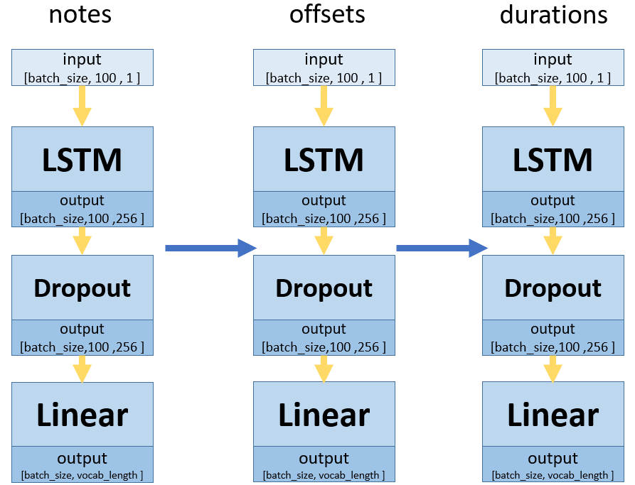

# music-generator

This project is trying to generate music with pytorch tools.

## Introduction

Beautiful music has the power to cultivate our emotions. However, finding pleasing compositions is a rarity that only few genius are able to do. Hence, with the advancement of AI technology today, we would like to utilize machine learning to adding captivating melodies to the world.

We refer to ['Keras-LSTM-Music-Generator'](https://github.com/jordan-bird/Keras-LSTM-Music-Generator) - which has already developed an impressive model using Keras and TensorFlow. However, as TensorFlow compatibility with modern GPUs has become limited, we aim to build a new model using PyTorch and strive to design an improved system that enhances the quality of music generation.

## Dataset

We use the same datasets as the project ['Keras-LSTM-Music-Generator'](https://github.com/jordan-bird/Keras-LSTM-Music-Generator), which consist of classical piano music.

## Preprocess

1. Use music21.converter.parse() to change each music in our datasets to 'music21.stream.Stream' objects.
2. Check weather the file has instrument parts or not. If so, partitions the stream by instrument and retrieves the notes. Otherwise, directly retrieves the notes using midi.flat.notes.
3. For each note or chord element in the parsed MIDI data, append the corresponding representation (pitch or normal order of chord notes) to the notes list.
4. Calculates and appends the offset (difference from the previous note) and the duration of the element to the offsets and durations lists, respectively. 

## Model

Our model consists of three separate parts, each dedicated to training notes, offsets, and durations. Each part follows the same architecture, consisting of an LSTM layer, a dropout layer, and a linear layer. Below is our model dlagram.

## How to Training

1. Move your directory to 'main' folder.
2. Start to train model with the command "python train.py" to evoke train.py.
> Use -e to set the number of epochs.(default is 50)  
Use -b to set the batch size.(default is 512)  
Use -p to decide weather to do the preprocess.(default is 1, do preprocess)  
Use -st to decide how often to save the model.(default is 10, to save the model every 10 epochs)

3. After training, you will get several model in 'checkpoint' folder.
4. Run generate.py with
> -m --'model_name' to choose which model you want to use for generating music.  
-l to decide the length of music.  
-n to set the file name of your output file

5. Then you will get your midi file in 'output' folder.

